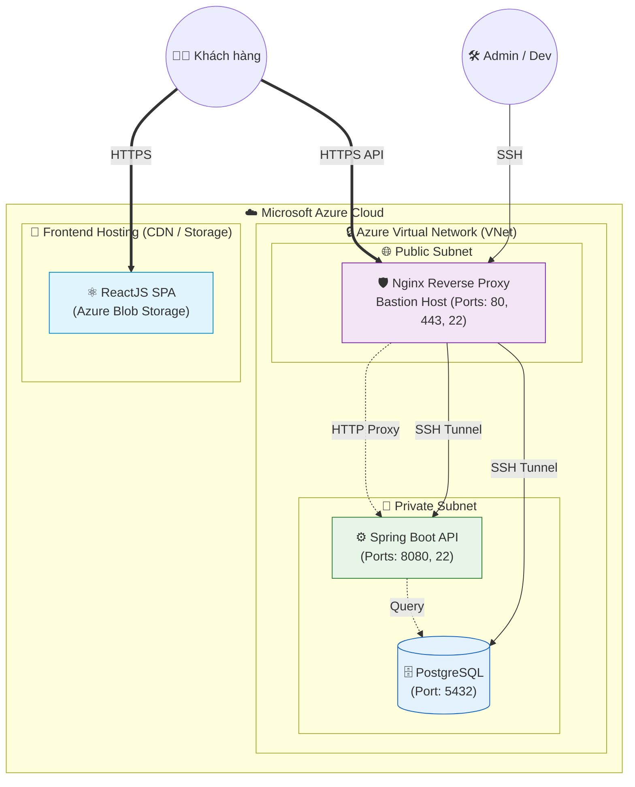
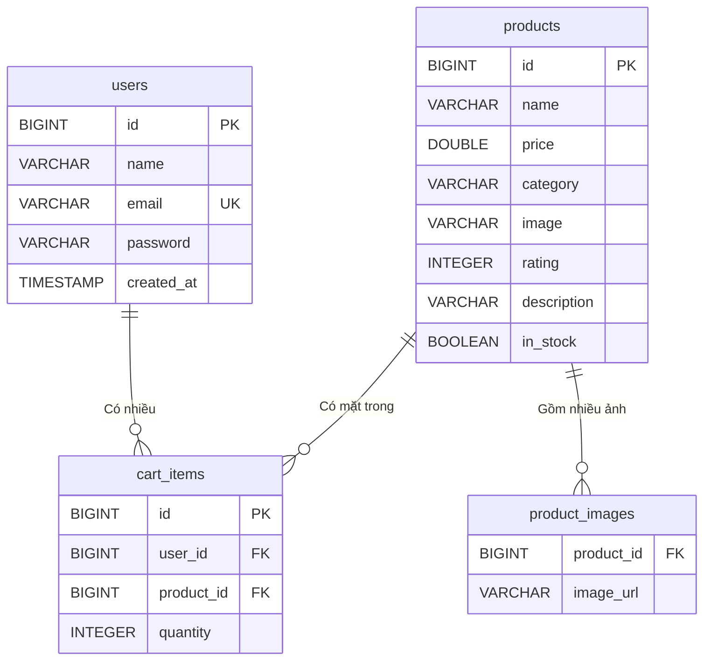
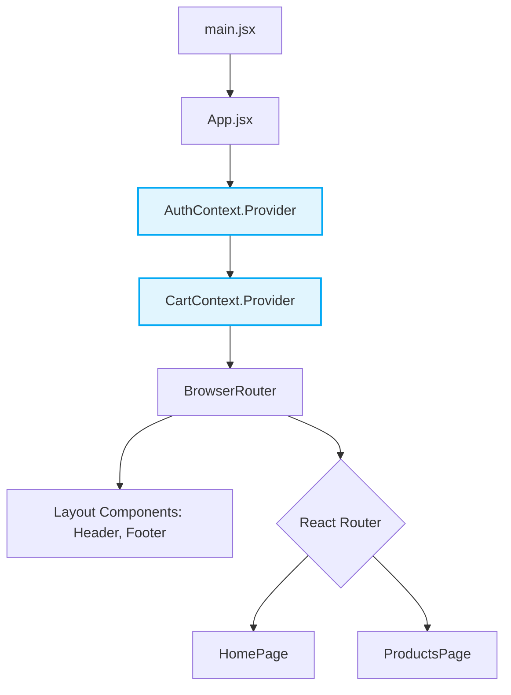

# 🛒 HexaShop E-Commerce Platform


HexaShop là một nền tảng thương mại điện tử toàn diện, được thiết kế theo kiến trúc phân tách hiện đại (Decoupled Architecture). Hệ thống mang lại trải nghiệm mua sắm mượt mà với giao diện React tĩnh cực nhanh và backend Spring Boot mạnh mẽ, bảo mật.

---

## 🏗️ 1. Kiến trúc Tổng quan (Overall Architecture)

Hệ thống được thiết kế để triển khai trên môi trường **Microsoft Azure Cloud** với trọng tâm vào bảo mật đa lớp (Defense in Depth) và khả năng mở rộng. Frontend được host tĩnh hoàn toàn, trong khi Backend và Database được khóa kín trong mạng nội bộ (*Private Subnet*).



---

## 🛠️ 2. Công nghệ sử dụng (Tech Stack)

### Frontend (`/hexashop-react`)
- **Core:** React 19, Vite, React Router v7
- **HTTP Client:** Axios
- **Styling / UI:** React Icons, Swiper Carousel
- **State Management:** React Context API (AuthContext, CartContext, SearchContext)

### Backend (`/hexashop-backend`)
- **Core:** Java 21, Spring Boot 3.2.5
- **Data Access:** Spring Data JPA, PostgreSQL (Sử dụng H2 cho môi trường test)
- **Security:** Spring Security, JWT (JSON Web Tokens) cho quá trình Xác thực & Phân quyền.

---

## 🗄️ 3. Sơ đồ Cơ sở Dữ liệu (Database ERD)

Database được tối ưu hóa cho nền tảng E-Commerce bao gồm quản lý người dùng, sản phẩm, và giỏ hàng.



---

## ⚛️ 4. Kiến trúc Frontend (Component Hierarchy)

Cấu trúc Frontend sử dụng Context Providers lồng nhau ở mức Root để quản lý trạng thái toàn cục (User login state, Cart items), đảm bảo luồng dữ liệu trơn tru từ Layout tới từng Trang.



---

## 📂 5. Cấu trúc Thư mục Dự án

```text
E-Comerce-Web/
├── doc/                                # 📚 Tài liệu hệ thống chi tiết (Architecture, Flow)
│   ├── backend/                        # Chứa ERD, Sequence Diagrams của API
│   ├── frontend/                       # Chứa sơ đồ Component, State Management
│   └── overall_project_architecture.md # Kiến trúc đám mây Azure tổng thể
├── hexashop-backend/                   # ⚙️ Mã nguồn Spring Boot Backend
│   ├── src/                            # Controllers, Services, Repositories, Entities
│   └── pom.xml                         # Cấu hình Dependencies Maven
└── hexashop-react/                     # ⚛️ Mã nguồn ReactJS Frontend
    ├── src/                            # Components, Contexts, Pages, Hooks
    └── package.json                    # Cấu hình NPM / Vite
```

---

## 🚀 6. Hướng dẫn Khởi chạy (Getting Started)

### Yêu cầu hệ thống (Prerequisites)
- **Java 21** & **Maven**
- **Node.js 18+** & **npm** (hoặc yarn/pnpm)
- **PostgreSQL** Server (Cổng mặc định `5432`)

### ⚙️ Bước 1: Chạy Backend
1. Mở terminal, đi tới thư mục backend: `cd hexashop-backend`
2. Tạo database trên PostgreSQL theo file cấu hình trong `src/main/resources/application.properties` (hoặc `.env`).
3. Chạy dự án Spring Boot: `mvn spring-boot:run`
4. Server API sẽ khởi chạy thành công ở cổng: **`http://localhost:8080`**

### ⚛️ Bước 2: Chạy Frontend
1. Mở một terminal mới, đi tới thư mục frontend: `cd hexashop-react`
2. Cài đặt các gói thư viện: `npm install`
3. Khởi chạy môi trường phát triển Vite: `npm run dev`
4. Truy cập giao diện mua sắm tại: **`http://localhost:5173`**

---

## 📖 7. Tài liệu Kỹ thuật Chi tiết

Để hiểu rõ hơn luồng xử lý và chi tiết từng logic của dự án, vui lòng tham khảo các tài liệu phân tích kỹ thuật chuyên sâu (đã có sẵn các sơ đồ biểu diễn):

- [Tài liệu Tổng quan Toàn dự án (Azure Architecture)](./doc/overall_project_architecture.md)
- **Backend Documents**:
  - [Sơ đồ CSDL đầy đủ (ERD)](./doc/backend/hexashop_erd.md)
  - [Luồng Xác thực & Token JWT](./doc/backend/auth_sequence_diagram.md)
  - [Luồng xử lý Giỏ hàng (Cart)](./doc/backend/cart_sequence_diagram.md)
- **Frontend Documents**:
  - [Cấu trúc Component Hệ thống](./doc/frontend/diagram_component_hierarchy.md)
  - [Sơ đồ Quản lý State (Context)](./doc/frontend/diagram_state_management.md)
  - [Hướng dẫn Tích hợp API cho Frontend](./doc/frontend/backend_integration_guide.md)

---
*Thiết kế và Phát triển bởi Minh Trúy*
