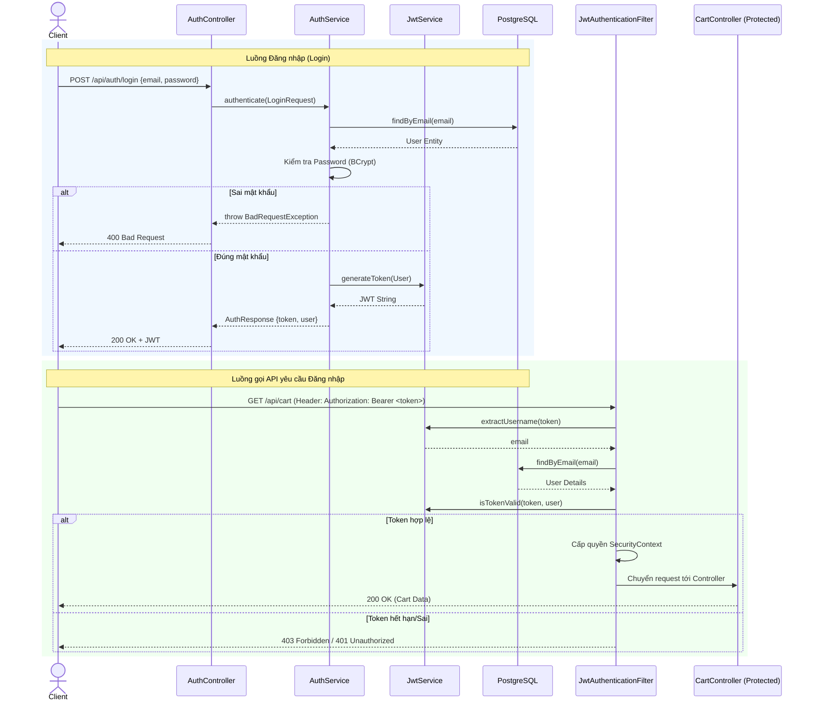

# Sơ đồ Tuần tự: Xác thực người dùng (Auth Sequence)

Sơ đồ này mô tả quá trình Đăng nhập (Login) và cách Token JWT được sử dụng để bảo vệ các API khác.

```mermaid
sequenceDiagram
    actor Client
    participant AuthCtrl as AuthController
    participant AuthSvc as AuthService
    participant JwtSvc as JwtService
    participant DB as PostgreSQL
    participant Filter as JwtAuthenticationFilter
    participant ProtectedCtrl as CartController (Protected)

    %% Flow Đăng nhập
    rect rgb(240, 248, 255)
        Note over Client, DB: Luồng Đăng nhập (Login)
        Client->>AuthCtrl: POST /api/auth/login {email, password}
        AuthCtrl->>AuthSvc: authenticate(LoginRequest)
        AuthSvc->>DB: findByEmail(email)
        DB-->>AuthSvc: User Entity
        AuthSvc->>AuthSvc: Kiểm tra Password (BCrypt)
        alt Sai mật khẩu
            AuthSvc-->>AuthCtrl: throw BadRequestException
            AuthCtrl-->>Client: 400 Bad Request
        else Đúng mật khẩu
            AuthSvc->>JwtSvc: generateToken(User)
            JwtSvc-->>AuthSvc: JWT String
            AuthSvc-->>AuthCtrl: AuthResponse {token, user}
            AuthCtrl-->>Client: 200 OK + JWT
        end
    end

    %% Flow gọi API yêu cầu bảo mật
    rect rgb(240, 255, 240)
        Note over Client, DB: Luồng gọi API yêu cầu Đăng nhập
        Client->>Filter: GET /api/cart (Header: Authorization: Bearer <token>)
        Filter->>JwtSvc: extractUsername(token)
        JwtSvc-->>Filter: email
        Filter->>DB: findByEmail(email)
        DB-->>Filter: User Details
        Filter->>JwtSvc: isTokenValid(token, user)
        alt Token hợp lệ
            Filter->>Filter: Cấp quyền SecurityContext
            Filter->>ProtectedCtrl: Chuyển request tới Controller
            ProtectedCtrl-->>Client: 200 OK (Cart Data)
        else Token hết hạn/Sai
            Filter-->>Client: 403 Forbidden / 401 Unauthorized
        end
    end
```
