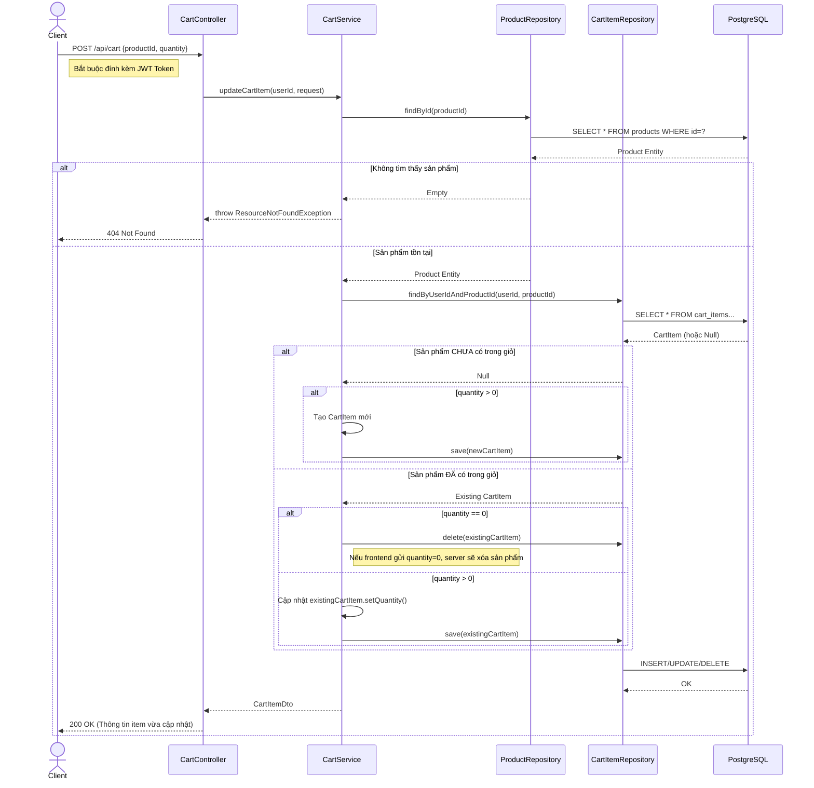

# Sơ đồ Tuần tự: Logic Giỏ hàng (Cart Sequence)

Mô tả luồng xử lý khi người dùng thêm một sản phẩm vào giỏ hàng hoặc đồng bộ giỏ hàng từ LocalStorage lên server.

```mermaid
sequenceDiagram
    actor Client
    participant Ctrl as CartController
    participant Svc as CartService
    participant ProdRepo as ProductRepository
    participant CartRepo as CartItemRepository
    participant DB as PostgreSQL

    Client->>Ctrl: POST /api/cart {productId, quantity}
    Note right of Client: Bắt buộc đính kèm JWT Token
    Ctrl->>Svc: updateCartItem(userId, request)
    
    Svc->>ProdRepo: findById(productId)
    ProdRepo->>DB: SELECT * FROM products WHERE id=?
    DB-->>ProdRepo: Product Entity
    
    alt Không tìm thấy sản phẩm
        ProdRepo-->>Svc: Empty
        Svc-->>Ctrl: throw ResourceNotFoundException
        Ctrl-->>Client: 404 Not Found
    else Sản phẩm tồn tại
        ProdRepo-->>Svc: Product Entity
        
        Svc->>CartRepo: findByUserIdAndProductId(userId, productId)
        CartRepo->>DB: SELECT * FROM cart_items...
        DB-->>CartRepo: CartItem (hoặc Null)
        
        alt Sản phẩm CHƯA có trong giỏ
            CartRepo-->>Svc: Null
            alt quantity > 0
                Svc->>Svc: Tạo CartItem mới
                Svc->>CartRepo: save(newCartItem)
            end
        else Sản phẩm ĐÃ có trong giỏ
            CartRepo-->>Svc: Existing CartItem
            alt quantity == 0
                Svc->>CartRepo: delete(existingCartItem)
                Note right of Svc: Nếu frontend gửi quantity=0, server sẽ xóa sản phẩm
            else quantity > 0
                Svc->>Svc: Cập nhật existingCartItem.setQuantity()
                Svc->>CartRepo: save(existingCartItem)
            end
        end
        
        CartRepo->>DB: INSERT/UPDATE/DELETE
        DB-->>CartRepo: OK
        Svc-->>Ctrl: CartItemDto
        Ctrl-->>Client: 200 OK (Thông tin item vừa cập nhật)
    end
```
