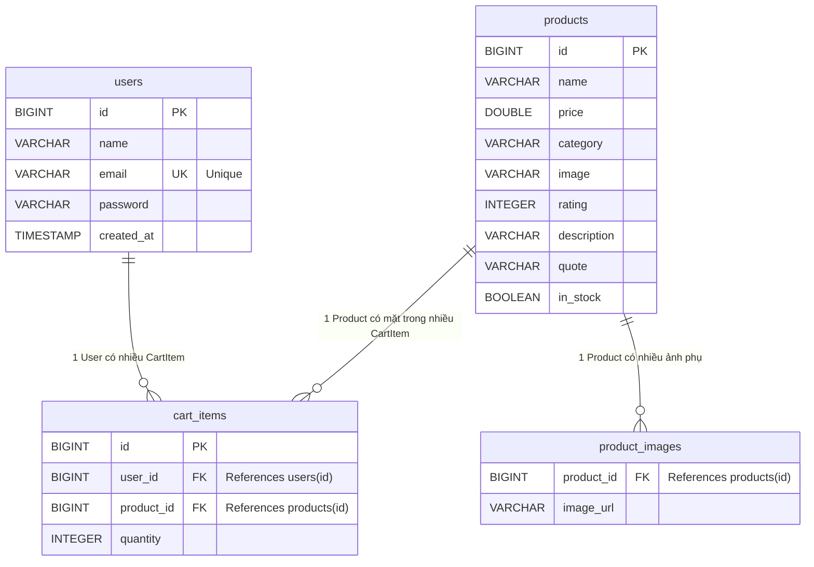

# Hexashop Entity Relationship Diagram (ERD)

Dưới đây là sơ đồ cấu trúc Cơ sở dữ liệu (Database Schema) của dự án Hexashop dựa trên các Entity JPA hiện tại.

### Chú thích chi tiết:
1. **Bảng `users` (Người dùng):**
   - Lưu thông tin cơ bản và thông tin đăng nhập. 
   - `email` được thiết lập `Unique` (Không được trùng lặp) để dùng làm tài khoản đăng nhập.

2. **Bảng `products` (Sản phẩm):**
   - Lưu trữ giá cả, danh mục (`category`), ảnh chính (`image`) và thông tin mô tả chi tiết của sản phẩm.

3. **Bảng `product_images` (Ảnh phụ của sản phẩm):**
   - Do một sản phẩm có thể có một mảng nhiều ảnh (List of images), Hibernate tự động tạo bảng phụ này nhờ annotation `@ElementCollection`. Bảng này liên kết với `products` thông qua `product_id`.

4. **Bảng `cart_items` (Giỏ hàng):**
   - Bảng trung gian kết nối giữa `users` và `products`.
   - Có một ràng buộc `UniqueConstraint(user_id, product_id)`: Đảm bảo rằng một người dùng không thể có 2 dòng của cùng 1 sản phẩm trong giỏ hàng (nếu mua thêm thì chỉ tăng `quantity` lên chứ không tạo dòng mới).
