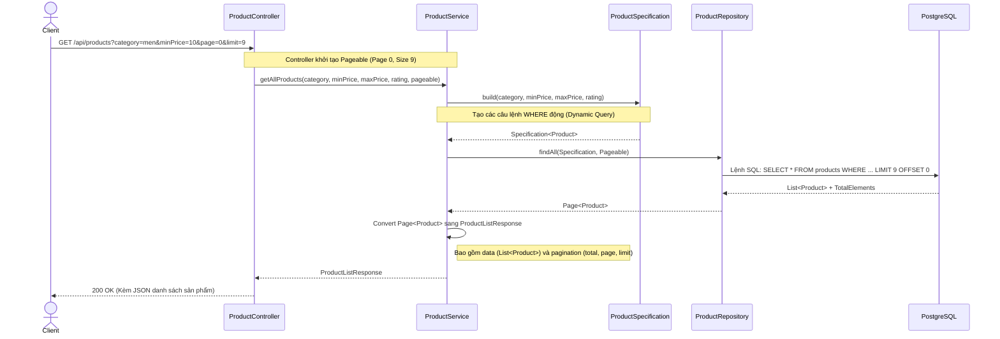

# Sơ đồ Tuần tự: Truy vấn Sản phẩm (Product Flow)

Sơ đồ mô tả luồng truy vấn sản phẩm hỗ trợ phân trang (Pagination) và lọc đa điều kiện (Filtering/Specification).

```mermaid
sequenceDiagram
    actor Client
    participant Ctrl as ProductController
    participant Svc as ProductService
    participant Spec as ProductSpecification
    participant Repo as ProductRepository
    participant DB as PostgreSQL

    Client->>Ctrl: GET /api/products?category=men&minPrice=10&page=0&limit=9
    
    Note over Ctrl,Svc: Controller khởi tạo Pageable (Page 0, Size 9)
    Ctrl->>Svc: getAllProducts(category, minPrice, maxPrice, rating, pageable)
    
    Svc->>Spec: build(category, minPrice, maxPrice, rating)
    Note over Svc,Spec: Tạo các câu lệnh WHERE động (Dynamic Query)
    Spec-->>Svc: Specification<Product>
    
    Svc->>Repo: findAll(Specification, Pageable)
    Repo->>DB: Lệnh SQL: SELECT * FROM products WHERE ... LIMIT 9 OFFSET 0
    DB-->>Repo: List<Product> + TotalElements
    
    Repo-->>Svc: Page<Product>
    Svc->>Svc: Convert Page<Product> sang ProductListResponse
    Note right of Svc: Bao gồm data (List<Product>) và pagination (total, page, limit)
    
    Svc-->>Ctrl: ProductListResponse
    Ctrl-->>Client: 200 OK (Kèm JSON danh sách sản phẩm)
```
