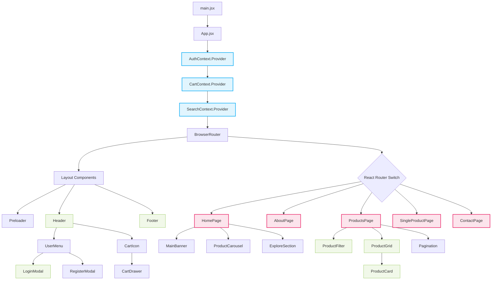

# Frontend Component Hierarchy Architecture

This diagram illustrates the component structure of the HexaShop React Application, detailing how React Router and Context Providers wrap the layout and individual pages.

