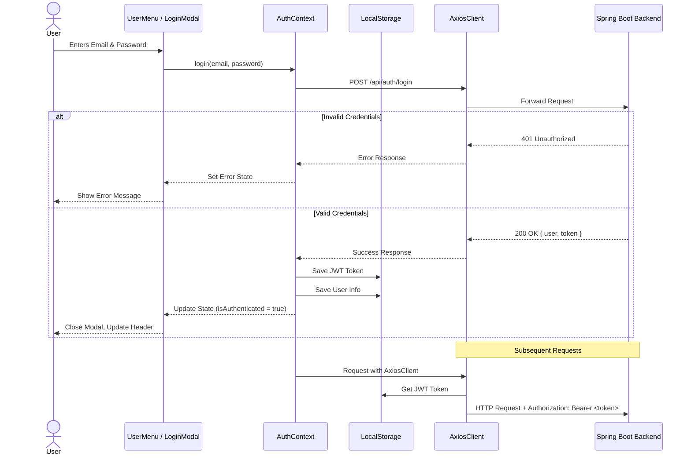

# Authentication Sequence Diagram

This diagram demonstrates the sequence of events when a user attempts to log in, including how tokens are stored and how Axios interceptors handle subsequent requests.

