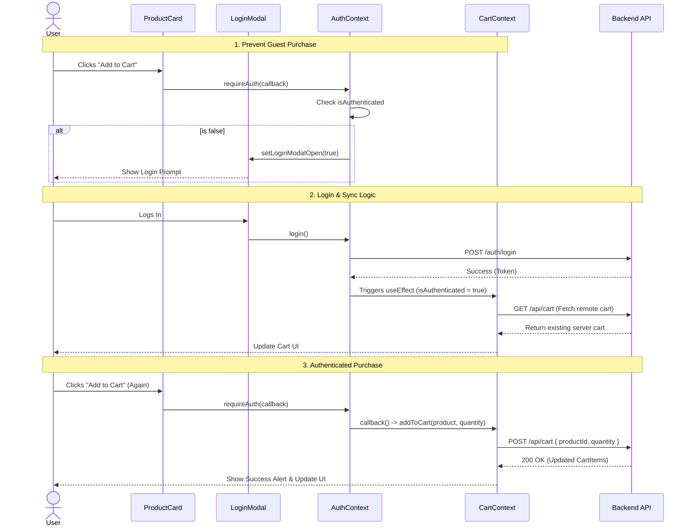

# Cart Lifecycle Sequence Diagram

This sequence diagram explains the complex cart logic, specifically focusing on the requirement that only authenticated users can buy, and how the cart synchronizes on login.

