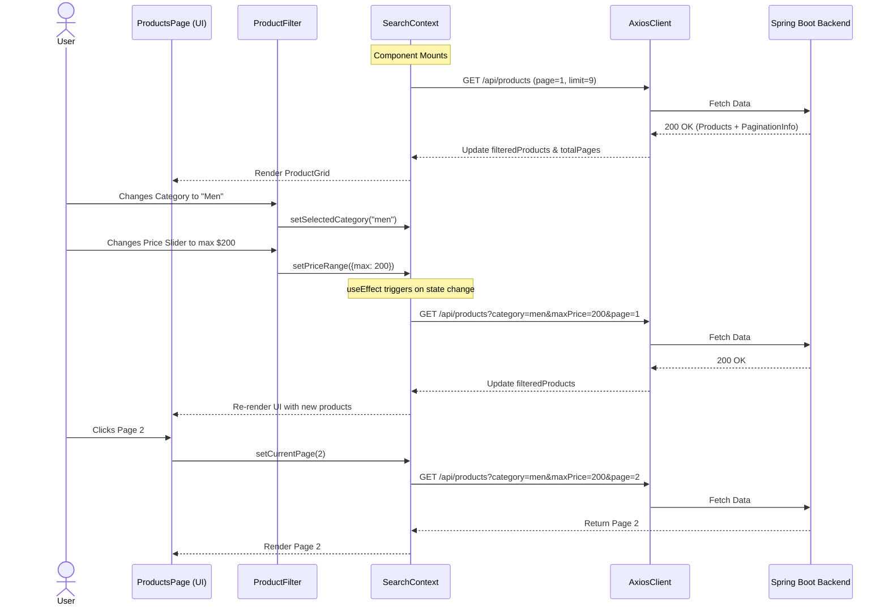

# Product Browsing & Filtering Sequence Diagram

This diagram shows how user interactions with the product filter trigger state changes in the `SearchContext`, which in turn fetches new paginated data from the backend.

