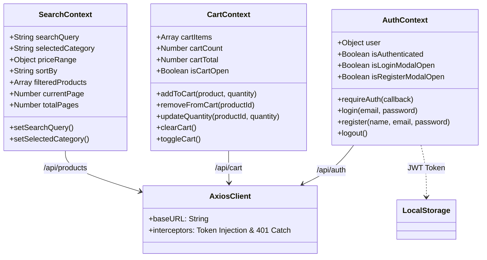

# Global State Management (Context API)

This class diagram represents the React Context API providers, their exposed state variables, and functions. It shows how the global state connects to the Backend APIs (via Axios).

