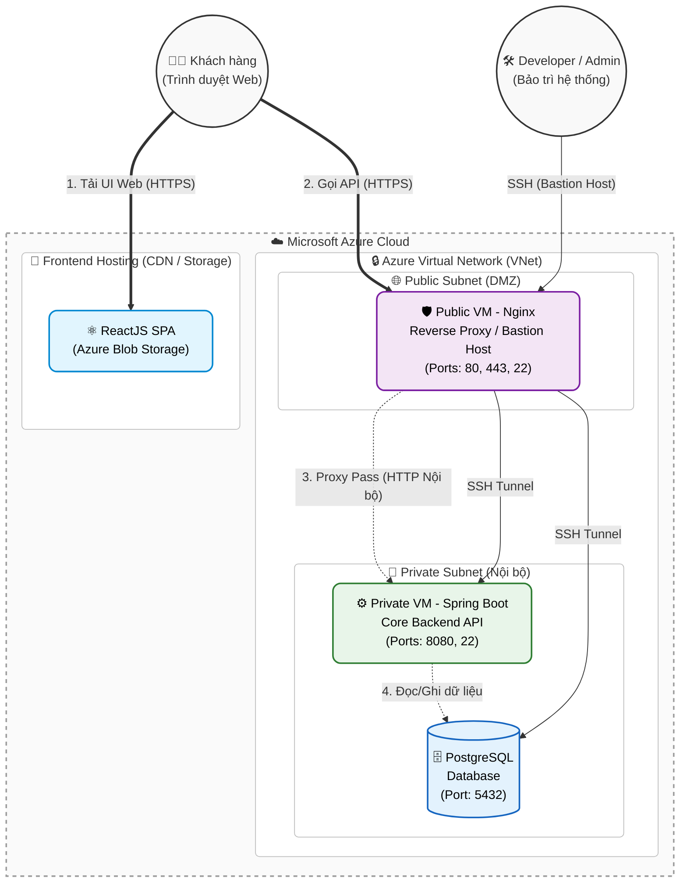
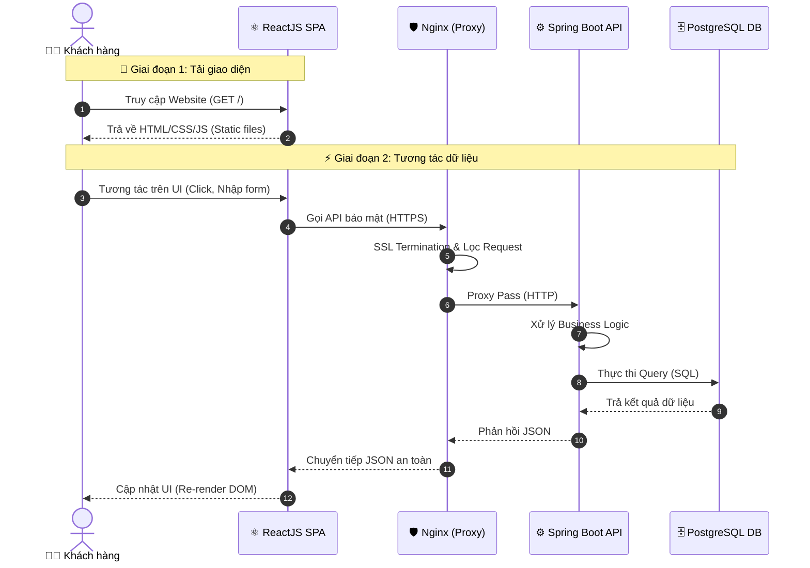

# 🏛️ Kiến trúc Tổng quan Dự án E-Commerce (Overall Architecture)

Tài liệu này thể hiện cái nhìn toàn cảnh về hệ thống E-Commerce Web, bao gồm Frontend, Backend và mô hình triển khai trên nền tảng **Microsoft Azure Cloud**.

---

## 1. 🌐 Sơ đồ Triển khai Cơ sở hạ tầng (Infrastructure Architecture)

Sơ đồ dưới đây mô tả cách các thành phần hệ thống được phân bổ trên hạ tầng đám mây, tập trung vào tính bảo mật, hiệu năng và khả năng mở rộng.

---

## 2. 🔄 Luồng Dữ liệu Chi tiết (Detailed Data Flow Diagram)

Sơ đồ này đi sâu vào cách thức các request từ người dùng được xử lý qua từng lớp của ứng dụng theo trình tự thời gian.

---

## 3. 🎯 Điểm nổi bật của Kiến trúc (Architecture Highlights)

Kiến trúc này mang lại các ưu điểm vượt trội cho hệ thống E-Commerce:

### 🌟 3.1. Phân tách Frontend & Backend (Decoupled Architecture)
- **Frontend** (ReactJS) được build thành các tệp tĩnh và lưu trữ trên **Azure Blob Storage / CDN**. 
- 📈 **Lợi ích**: Tối ưu hóa tốc độ tải trang nhờ phân phối qua CDN, giảm hoàn toàn tải tĩnh (static assets) cho máy chủ Backend, tiết kiệm chi phí hosting.

### 🛡️ 3.2. Bảo mật Đa lớp (Defense in Depth)
- **Không truy cập trực tiếp**: Người dùng bên ngoài chỉ được phép gọi vào `Nginx`. Backend API và Database bị "cách ly" hoàn toàn khỏi Internet.
- **Nginx Reverse Proxy**: Đặt tại *Public Subnet*, Nginx đóng vai trò là "người gác cổng", xử lý chứng chỉ SSL/TLS (HTTPS) và che giấu IP thực tế của các máy chủ nội bộ.
- **Private Subnet**: Database và API Server được khóa kín trong mạng nội bộ (*Private Network*), hạn chế tối đa các rủi ro từ những cuộc tấn công DDoS hay xâm nhập trực tiếp.

### 🔐 3.3. Quản trị An toàn qua Bastion Host
- Mọi thao tác bảo trì (Maintenance) từ Developer hoặc Admin đều phải đi qua **Nginx Server** bằng giao thức `SSH`.
- Server Nginx lúc này hoạt động như một **Bastion Host (Jump Box)**, tạo đường hầm kết nối an toàn (SSH Tunnel) để truy cập sâu vào các server nằm trong *Private Subnet*.
- 📉 **Lợi ích**: Giảm thiểu tối đa số lượng port mở ra ngoài Internet, tập trung giám sát và ghi log kiểm toán (audit) tại một điểm duy nhất.

---
> **💡 Mẹo nhỏ:** Để hiển thị sơ đồ tốt nhất, vui lòng xem tài liệu này trên các công cụ hỗ trợ Markdown Mermaid như VS Code (có cài extension), GitHub, hoặc Obsidian.
