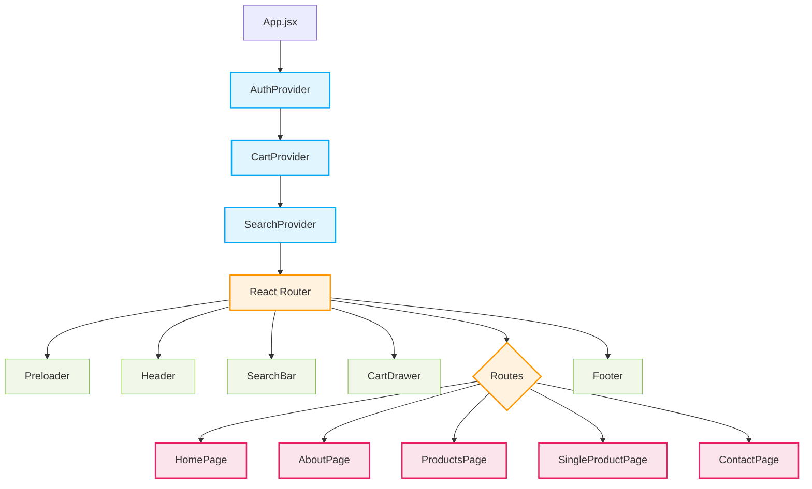
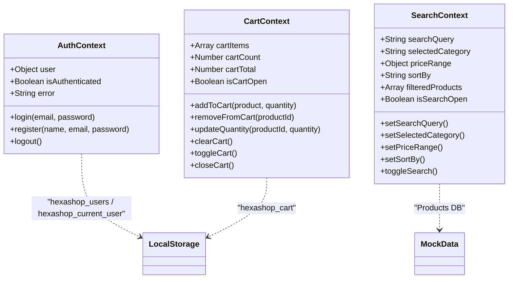
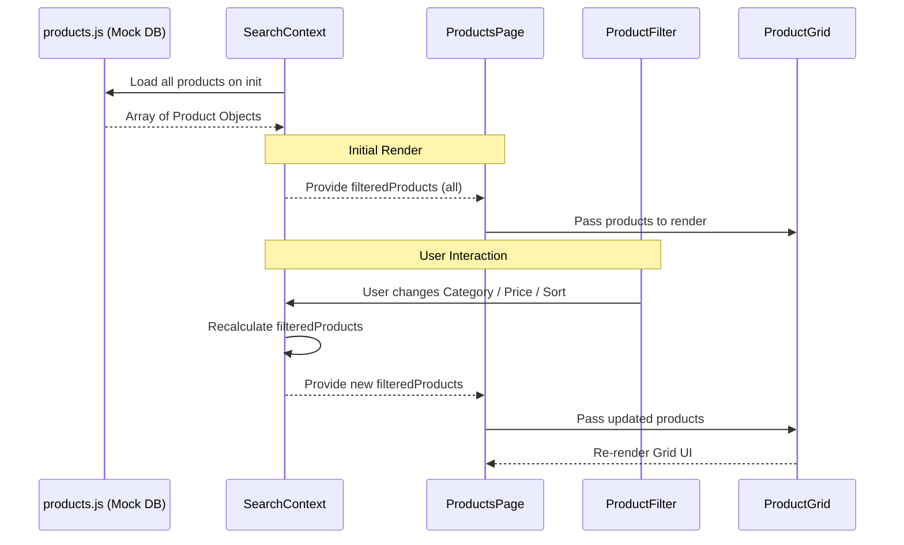

# HexaShop React Frontend Architecture

This document provides a comprehensive overview of the frontend architecture for the HexaShop React application. These diagrams are designed to help backend engineers understand the current frontend state management, data flow, and component hierarchy to facilitate API integration.

## 1. High-Level Component Architecture

This diagram illustrates the overall structure of the React application, showing how Context Providers wrap the main application and provide state to the different routes and components.

## 2. Global State Management (Context API)

The application relies on React Context for global state management. Currently, data is mocked and persisted to `localStorage`. When the backend is ready, these Context Providers will be the primary locations for implementing API calls (e.g., using `fetch` or `axios`).

## 3. Data Flow: Product Retrieval & Search

This diagram shows how product data flows from the underlying data source (currently `src/data/products.js`), through the `SearchContext` for filtering and sorting, and finally to the UI components.

## 4. Integration Guide for Backend Developers

When transitioning from the current `localStorage` and mock data setup to a real backend API, you will primarily need to update the Context Providers. 

### A. Auth Integration (`src/context/AuthContext.jsx`)
- Replace the `localStorage` user array check in the `login` function with a POST request to `/api/auth/login`.
- Store the returned JWT token (in an HTTP-only cookie or memory/local storage depending on strategy).
- Replace the `register` function with a POST request to `/api/auth/register`.

### B. Product Integration (`src/context/SearchContext.jsx` & `src/data/products.js`)
- Currently, `SearchContext` loads all products from memory and filters them client-side.
- **For small datasets**: You can simply replace the `products.js` import with a single `useEffect` `fetch` call to `/api/products` on app load.
- **For large datasets**: You will need to change `SearchContext` to fetch from the server dynamically based on query parameters (e.g., `/api/products?category=men&minPrice=0&maxPrice=50&sortBy=price-asc`). Server-side pagination will also need to be implemented.

### C. Cart & Order Integration (`src/context/CartContext.jsx`)
- Currently, the cart is saved purely to `localStorage`.
- To persist carts for logged-in users, `CartContext` should listen to `AuthContext`.
- When `isAuthenticated` is true, sync the cart state with the backend via `GET /api/cart`, `POST /api/cart/item`, `PUT /api/cart/item/:id`, and `DELETE /api/cart/item/:id`.
- Implement a Checkout Component that reads the `CartContext.cartItems` and submits an order via `POST /api/orders`.
